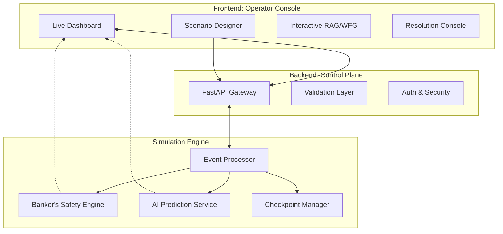

# 🛡️ SafeSched: Enterprise Deadlock Management & Resolution Suite

**SafeSched** is an industry-grade resource management platform designed for high-availability systems. It combines deterministic mathematical safety with predictive risk analysis to provide the most secure environment for complex task scheduling.

---

## 🌟 Core Product Features

### 🛠️ High-Fidelity Simulation Suite
*   **Real-World Modeling**: Input complex resource matrices mirroring real server environments (CPU, memory, storage, specialized hardware).
*   **Deterministic Replay**: Seed-based execution allows administrators to re-run exact failure scenarios for post-mortem analysis.
*   **Validation Layer**: Integrated checks for over-allocation and inconsistent system states.

### 🧪 Hybrid Decision Engine
SafeSched utilizes a dual-layered approach to system integrity:
1.  **Banker's Safety Core (L1)**: An iterative mathematical implementation that guarantees zero false negatives. If a state is mathematically unsafe, SafeSched blocks it.
2.  **Predictive Risk AI (L2)**: A Logistic Regression model trained on **1,000+ simulation execution traces**. It identifies high-pressure "near-deadlock" zones before they occur.

### ⚡ Recovery & Self-Healing
*   **Cost-Optimized Preemption**: Automatically selects the "victim" process based on held resources, wait times, and system priority.
*   **Atomic Rollback**: Instantly reclaims resources to the system pool to break deadlocked cycles.
*   **Checkpoint Management**: Snapshot system states at every major event for rapid recovery.

---

## 🏗️ System Architecture



---

## 🚀 Roadmap: Coming Soon

While the core engine is battle-tested, we are currently developing feature-rich upgrades for enterprise scale:

*   **[COMING SOON] Distributed Consensus**: Integration of Raft/Paxos for multi-node simulation consistency.
*   **[COMING SOON] Chaos Engineering Suite**: Automated fault injection to test scheduler resilience under node failure.
*   **[COMING SOON] Dynamic Cluster Scaling**: Support for nodes joining or leaving the resource pool in real-time.
*   **[COMING SOON] OpenTelemetry Integration**: Export simulation metrics directly to Prometheus/Grafana.

---

## 📊 Technical Specifications
*   **Engine**: Python 3.10+ (FastAPI + NumPy)
*   **AI Stack**: Scikit-Learn (Logistic Regression with Balanced Weights)
*   **UI Architecture**: React 18 + TypeScript + Tailwind CSS
*   **Visualizations**: Cytoscape.js (Interactive Graphs) + Recharts (Metrics)

---
*SafeSched: Ensuring Logical Integrity in Distributed Environments.*

---

## 📂 Repository Structure

```text
SafeSched/
├── backend/
│   ├── app/
│   │   ├── core/
│   │   │   ├── banker.py
│   │   │   ├── cluster_manager.py
│   │   │   ├── deadlock_detector.py
│   │   │   ├── distributed_checkpoint_manager.py
│   │   │   ├── distributed_deadlock_detector.py
│   │   │   ├── graph_builder.py
│   │   │   ├── request_queue.py
│   │   │   ├── simulation_engine.py
│   │   │   └── validator.py
│   │   ├── models/
│   │   │   ├── event_models.py
│   │   │   ├── resource_models.py
│   │   │   └── system_models.py
│   │   ├── services/
│   │   │   └── scenario_service.py
│   │   └── utils/
│   │       └── helpers.py
│   ├── tests/
│   │   ├── test_banker.py
│   │   ├── test_deadlock.py
│   │   ├── test_deadlock_dataset_generator.py
│   │   ├── test_distributed_system.py
│   │   ├── test_edge_cases.py
│   │   ├── test_event_log_and_scalability.py
│   │   ├── test_graph_builder.py
│   │   ├── test_recovery_and_rollback.py
│   │   ├── test_replay_and_export.py
│   │   ├── test_request_queue.py
│   │   ├── test_simulation.py
│   │   └── test_validator.py
│   └── SAFE_BACKEND_OVERVIEW.md
├── config/
│   └── generator_config.json
├── datasets/
│   ├── dead_data.csv
│   ├── dead_data_preprocess_report.json
│   └── dead_data_preprocessed.csv
├── frontend/
│   ├── public/
│   │   ├── index.html
│   │   ├── manifest.json
│   │   └── robots.txt
│   ├── src/
│   │   ├── App.css
│   │   ├── App.test.tsx
│   │   ├── App.tsx
│   │   ├── index.css
│   │   ├── index.tsx
│   │   ├── reportWebVitals.ts
│   │   ├── service-worker.ts
│   │   ├── serviceWorkerRegistration.ts
│   │   └── setupTests.ts
│   ├── index.html
│   ├── package.json
│   ├── postcss.config.js
│   ├── tailwind.config.js
│   ├── tsconfig.json
│   ├── tsconfig.node.json
│   ├── vercel.json
│   └── vite.config.ts
├── models/
│   ├── logistic_regression_deadlock.joblib
│   └── logistic_regression_metrics.json
├── safesched-deadlock_api/
│   ├── models/
│   │   ├── logistic_regression_deadlock.joblib
│   │   └── logistic_regression_metrics.json
│   ├── README.md
│   ├── apprunner.yaml
│   ├── main.py
│   ├── requirements.txt
│   └── start.sh
├── scripts/
│   ├── check_parquet_results.py
│   ├── custom_logger.py
│   ├── custom_policy.py
│   ├── deadlock_train_schema.json
│   ├── edge_cases_config.json
│   ├── generate_deadlock_dataset.py
│   ├── merge_dataset_parts.py
│   ├── parallel_generate_deadlock_dataset.py
│   ├── preprocess_dead_data.py
│   ├── run_generator.py
│   └── train_logistic_regression.py
├── README.md
├── requirements.txt
└── SafeSched Development Flow.md
```
